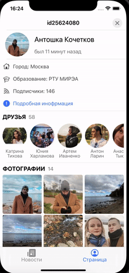

# VKMVVM
app for VK using API and MVVM architecture.

The app works with the [VK API](https://dev.vk.com) and receives a news feed and profile data.

### Installation

In the project has been used [carthage](https://github.com/Carthage/Carthage) and [iOS SDK](https://dev.vk.com/sdk/ios)
To install dependencies you need to [install carthage](https://github.com/Carthage/Carthage#installing-carthage)

Then you need to install the dependencies, go to the project directory and in the terminal enter the command

  ```
  carthage update --use-xcframeworks
  ```

### App description

1. News section
 - includes viewing the news feed and the ability to view the photo in full size and like the post

2. Profile section

 - includes viewing general profile information, status, profile photos, and profile albums. Also view the list of friends and go to their profiles, view followers
 - There is a logout button on your profile page.

Application design is made according to VK 7.13 version

View the app




## Received knowledge

- UIKit
- iOS SDK VK
- API VK
- Multithreading
- MVVM architecture
- Package manager - Carthage
